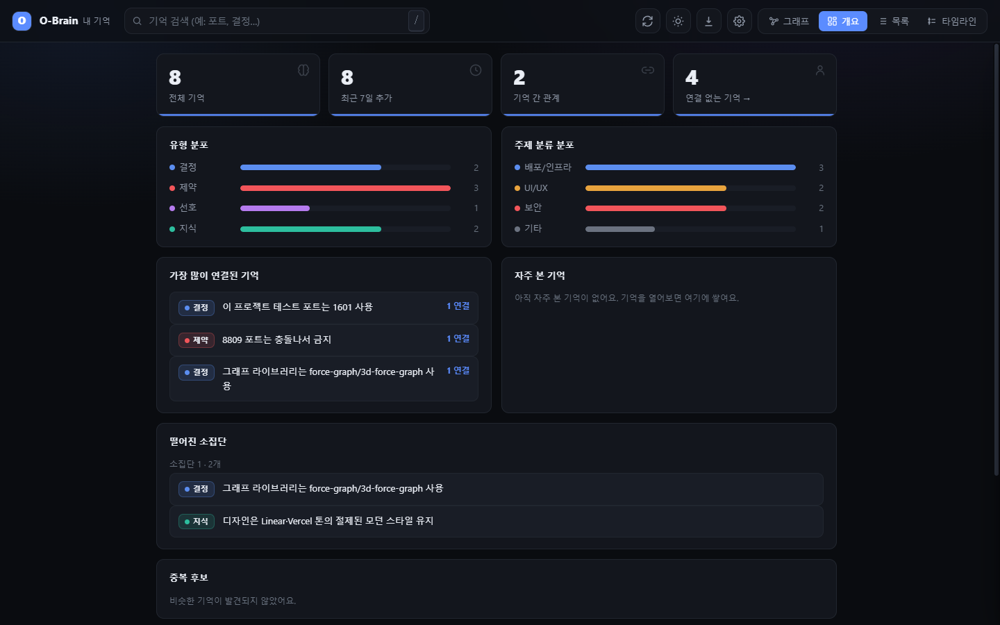
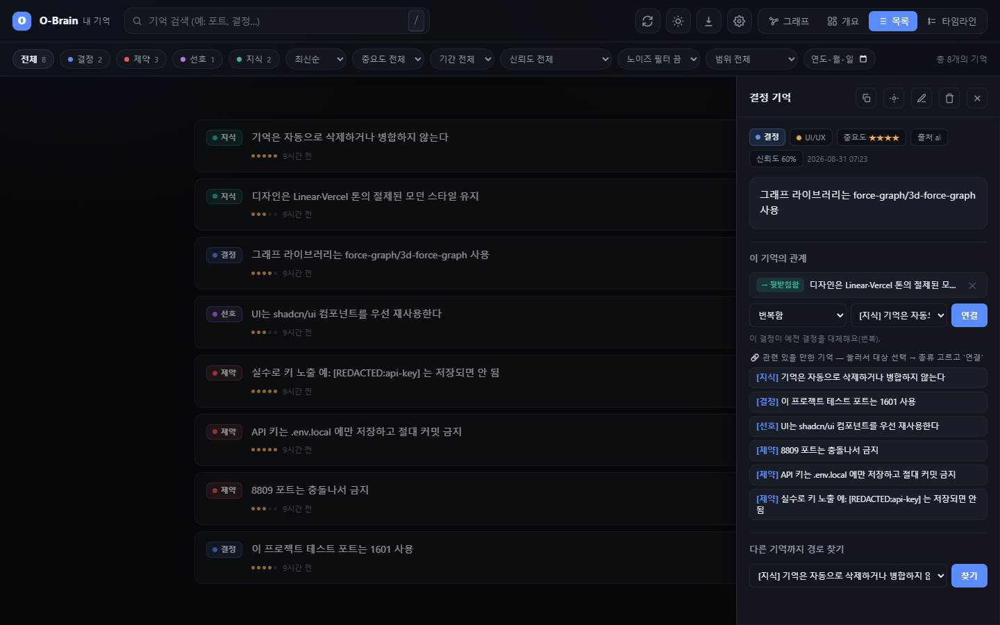
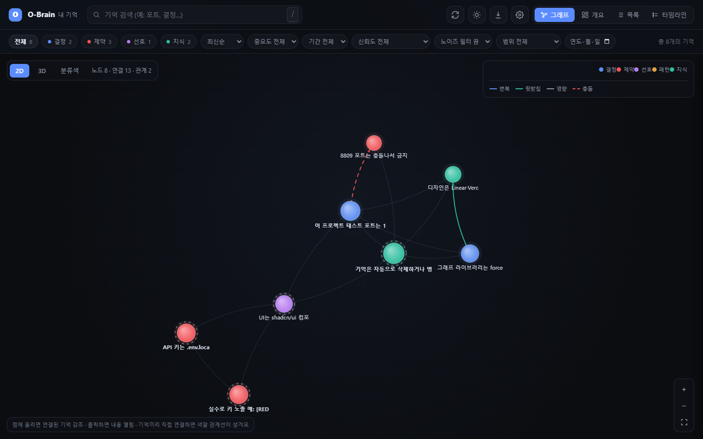
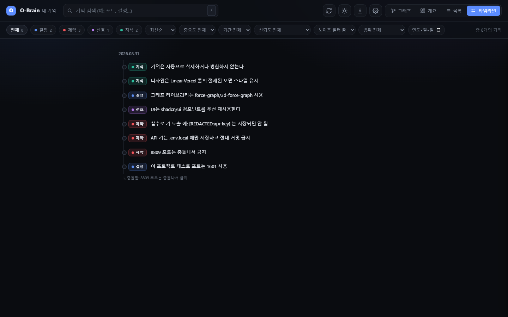
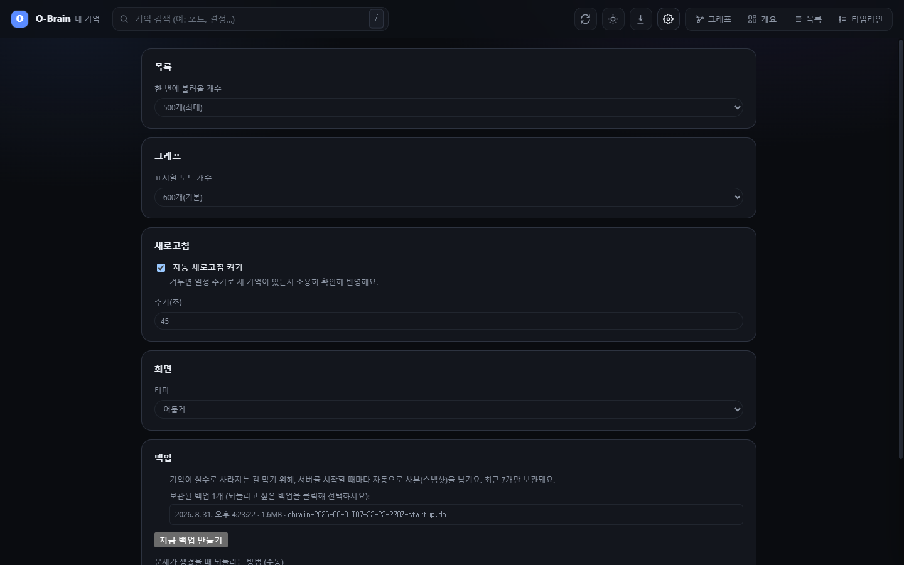

[한국어](./README.md) · [HTML](./README.en.html) · [Codex repository](https://github.com/sodam-ai/SoDam_O-Brain-Codex) · [Pre-port original](https://github.com/sodam-ai/SoDam_O-Brain)

# SoDam O-Brain for Codex

O-Brain is a personal, local memory plugin that stores user-confirmed decisions, constraints, preferences, and knowledge from Codex conversations in a **SQLite database on your computer**. It recalls related memories in later tasks and includes 2D/3D graph, list, timeline, search, and backup views.

> Official source repository: [github.com/sodam-ai/SoDam_O-Brain-Codex](https://github.com/sodam-ai/SoDam_O-Brain-Codex). This guide covers installation and use of the Codex port.

> **“Runs locally” does not mean that installation files must come from a private local folder.** Anyone can download the project from the official GitHub repository above. Execution and memory storage then stay on the user's computer. None of the commands below contains the maintainer's personal work path.

## Table of Contents

1. [What It Does](#what-it-does)
2. [Verified Scope and Support Status](#verified-scope-and-support-status)
3. [Prerequisites and Required Software](#prerequisites-and-required-software)
4. [Download and Installation](#download-and-installation)
5. [Quick Start and Running](#quick-start-and-running)
6. [How to Use](#how-to-use)
7. [Commands and Tests](#commands-and-tests)
8. [Files and Data Locations](#files-and-data-locations)
9. [Workflow and Architecture](#workflow-and-architecture)
10. [Security and Privacy](#security-and-privacy)
11. [Backup, Export, and Recovery](#backup-export-and-recovery)
12. [Updates](#updates)
13. [Troubleshooting](#troubleshooting)
14. [FAQ](#faq)
15. [License, Copyright, and Commercial Use](#license-copyright-and-commercial-use)

## What It Does

| Feature | Description |
|---|---|
| Automatic capture | A Codex `Stop` hook finds confirmed statements in recent conversation and saves them. Questions, casual chat, and AI replies are excluded. |
| Automatic recall | A `SessionStart` hook selects a small set of memories related to the current project and adds them to Codex context. |
| Seven MCP tools | Search, save, single-item retrieval, related items, timeline, relation creation, and category listing. |
| Local search | Combines FTS5 keyword search with 384-dimensional local embeddings. |
| Visualization | Overview, list/detail, 2D/3D graph, timeline, and settings views. |
| Data safety | SQLite WAL, online backups, input limits, secret redaction, and pre-delete backups. |
| Compatible parser | Reads Codex `response_item` logs and the original Claude Code logs. Codex sessions are stored with the tool value `codex`. |

O-Brain does not store everything you say. Rule-based extraction selects user statements with clear confirmation signals such as “we decided,” “must,” or “I prefer.” Use `$o-brain-remember` when a critical item should be saved explicitly.

## Verified Scope and Support Status

| Item | Current status |
|---|---|
| Primary environment | Windows 10/11 with the Codex app or CLI |
| Actually verified versions | Node.js `v26.7.0`, npm `11.6.2`, Codex CLI `0.155.1` |
| Network | Required for installation, dependencies, and first model download. Memory storage and search are local |
| Mobile | The 390px-wide layout was checked, but phone access is unsupported because the server is limited to the same PC |
| Login/account | O-Brain has no account or login system. Codex access belongs to the OpenAI account layer |
| External DB/payment | O-Brain has no dedicated external database or payment feature |
| macOS/Linux | User-directory defaults exist in code, but installation and UI flows were not live-verified for this release |

Verified behavior is separated from unverified scope. “Supported” here means checked in the current code and tests; it is not a warranty for every computer configuration.

## Prerequisites and Required Software

Programs to install first:

| Program | Why it is needed | Official download or guide |
|---|---|---|
| Windows 10/11 computer | Operating system live-verified for this release | Use the PowerShell included with Windows |
| Node.js 26.7.x + npm 11.x | Runs the local server, database, and tests | [Official Node.js v26.7.0 download](https://nodejs.org/en/download/archive/v26.7.0) |
| Codex app or Codex CLI | Loads the O-Brain plugin and processes conversations | [Codex app guide](https://developers.openai.com/codex/app) · [Codex CLI guide](https://developers.openai.com/codex/cli) |
| Git (optional) | Used for `git clone` installation and later updates | [Official Git for Windows installer](https://git-scm.com/install/windows). Skip it for ZIP or remote Marketplace installation |

Internet access is required for the first `npm ci` and embedding-model download. At least 1 GB of free space is recommended for Node dependencies and the local model cache.

Beginner terms:

| Term | Plain meaning |
|---|---|
| Folder path | A file address, such as `C:\Tools\SoDam_O-Brain-Codex`. |
| Command | A line entered in PowerShell and run with Enter. |
| Plugin | An installable bundle that adds features to Codex. |
| Local | Processing happens on this computer. |
| DB (SQLite) | A database that organizes memories in one file. |
| Port | A number used to find the local server. Default: `7740`. |

Run these checks one line at a time:

```powershell
node --version
npm --version
codex --version
```

This port was verified with Node.js `v26.7.0`, npm `11.6.2`, and Codex CLI `0.155.1`. Other versions may work, but they are not claimed as verified here.

## Download and Installation

Download the project from the official [SoDam_O-Brain-Codex GitHub repository](https://github.com/sodam-ai/SoDam_O-Brain-Codex). The program and its memory data remain local even though installation files come from GitHub. Use a branch or release that contains the Codex port.

| Method | Choose it when |
|---|---|
| GitHub remote Marketplace | You want the shortest installation commands |
| Git clone | You want easier updates and source inspection |
| Download ZIP | You are not comfortable with Git commands |
| Standalone web app | You want to try the dashboard and local DB without the Codex plugin |

On GitHub, first confirm that the selected branch or release contains `.agents/plugins/marketplace.json` and `plugins/o-brain/`. If either is missing, that branch does not yet contain the Codex port.

### Install directly from the GitHub remote marketplace

This method needs no manual Git clone or ZIP download. Use it after the Codex-port files are published in the GitHub repository.

~~~powershell
codex plugin marketplace add sodam-ai/SoDam_O-Brain-Codex
codex plugin add o-brain@o-brain-codex
~~~

A full HTTPS Git URL is also supported.

~~~powershell
codex plugin marketplace add https://github.com/sodam-ai/SoDam_O-Brain-Codex.git
codex plugin add o-brain@o-brain-codex
~~~

A branch that does not yet contain the Codex-port files is not compatible with this installation command.

### Install after Git clone

~~~powershell
git clone https://github.com/sodam-ai/SoDam_O-Brain-Codex.git
cd "SoDam_O-Brain-Codex"
codex plugin marketplace add .
codex plugin add o-brain@o-brain-codex
~~~

### Install from a downloaded ZIP

1. In the confirmed GitHub repository, select Code > Download ZIP.
2. Extract the ZIP and open that folder in File Explorer.
3. Enter powershell in File Explorer's address bar and press Enter.
4. Run:

~~~powershell
codex plugin marketplace add .
codex plugin add o-brain@o-brain-codex
~~~

### Install the marketplace from the downloaded folder

Open PowerShell inside the SoDam_O-Brain-Codex folder obtained by Git clone or ZIP, then run:

```powershell
codex plugin marketplace add .
```

### Install and verify the plugin

```powershell
codex plugin add o-brain@o-brain-codex
```

Verify installation:

```powershell
codex plugin list | Select-String "o-brain"
```

### Prepare dependencies for the first run

Open a new Codex task and ask:

```text
Use the $o-brain-setup skill to complete first-time setup and run its self-test.
```

For manual setup, run these commands from the installed plugin root:

```powershell
node scripts/o-brain-cli.mjs setup
node scripts/o-brain-cli.mjs selftest
```

Setup runs `npm ci` with the locked dependencies. The first search or test may download the `sentence-transformers/all-MiniLM-L6-v2` model.

### Updating

Create a backup with `$o-brain-backup` first.

For a GitHub remote marketplace, refresh and reinstall in this order:

~~~powershell
codex plugin marketplace upgrade o-brain-codex
codex plugin remove o-brain@o-brain-codex
codex plugin add o-brain@o-brain-codex
~~~

For Git clone, ZIP, or local-folder installation, update the source folder first and then refresh the plugin cache:

~~~powershell
codex plugin remove o-brain@o-brain-codex
codex plugin add o-brain@o-brain-codex
~~~

Run `$o-brain-setup` again. The personal database is outside the plugin cache and is not removed by a normal reinstall.

### Uninstalling

```powershell
codex plugin remove o-brain@o-brain-codex
codex plugin marketplace remove o-brain-codex
```

These commands remove the plugin but do not automatically delete personal data. To erase it, create a backup first, inspect `%LOCALAPPDATA%\SoDamAI\O-Brain`, and delete that folder yourself.

## Quick Start and Running

1. Open a new Codex task after installation.
2. Run `$o-brain-setup` once.
3. State a confirmed decision, for example: “We decided to use port 7740 for this project's tests.”
4. End the task normally. The `Stop` hook redacts secrets and saves candidates.
5. Start a new task. The `SessionStart` hook recalls related memories into context.
6. Run `$o-brain-open` to inspect the dashboard.

To try only the standalone web app:

```powershell
cd app
npm ci
npm start
```

Open `http://127.0.0.1:7740/`. Direct `npm start` uses `app/data/` by default. Codex plugin entry points use the external user data directory by default.

### Start and stop

- `$o-brain-open` starts a background server when needed and opens the browser.
- Stop an `npm start` server with `Ctrl+C` in its PowerShell window.
- The background server has no `stop` command yet. Confirm saves and backups before Task Manager.
- Stopping the server does not delete SQLite memories.

## How to Use

### Codex skills

Type `/o-brain:open` in the composer, select `o-brain:open` from autocomplete, then send the message. Select other commands using the same names in the table below. In Codex, selecting a slash-menu skill attaches that skill to the message. If the list does not appear, fully quit and reopen Codex to reload installation information. The plugin must be installed in the Codex configuration directory used by the desktop app. Submitting the command text without selecting the menu item has not been separately verified.

| Original Claude Code command | Codex menu name | Explicit Codex invocation | Behavior |
|---|---|---|---|
| `/o-brain:open` | `o-brain:open` | `$o-brain:open` | Check/start the server and open the dashboard |
| `/o-brain:status` | `o-brain:status` | `$o-brain:status` | Show memory counts, recent memories, and hook status |
| `/o-brain:backup` | `o-brain:backup` | `$o-brain:backup` | Create a safe SQLite backup |
| `/o-brain:selftest` | `o-brain:selftest` | `$o-brain:selftest` | Run checks in a temporary database |
| `/o-brain:remember` | `o-brain:remember` | `$o-brain:remember` | Save confirmed user decisions after checking duplicates |
| `/o-brain:link` | `o-brain:link` | `$o-brain:link` | Link memory relations only after user confirmation |

The additional setup helper is `$o-brain:setup`. The existing `$o-brain-*` skills below remain available. Desktop and CLI installations are separate when their Codex homes differ. Successful CLI execution alone does not prove desktop installation. Restart Codex if the menu does not refresh.
| Skill | Purpose |
|---|---|
| `$o-brain-setup` | Install dependencies and run the first self-test |
| `$o-brain-open` | Check/start the local server and open the dashboard |
| `$o-brain-status` | Show memory count, recent items, and data location |
| `$o-brain-backup` | Create a safe online SQLite snapshot |
| `$o-brain-selftest` | Test core behavior in an isolated database |
| `$o-brain-remember` | Manually save only confirmed items from the current conversation |
| `$o-brain-link` | Connect only memory relations confirmed by the user |

### MCP tools

| Tool | Purpose |
|---|---|
| `search_memory` | Semantic and keyword search |
| `save_memory` | Save after secret redaction |
| `get_memory` | Retrieve one full memory |
| `get_related` | Retrieve directly connected memories |
| `get_timeline` | Retrieve chronological history by topic |
| `add_relation` | Add `SUPERSEDES`, `SUPPORTS`, `INFLUENCES`, or `CONTRADICTS` |
| `list_categories` | List memory counts by category |

O-Brain does not automatically decide relation types. Only user-confirmed relations are saved to avoid inventing causality.

### Dashboard

- **Overview**: counts, types, categories, and recent status
- **List**: search, filters, detail, edit, delete, and duplicate cleanup
- **Graph**: 2D/3D relationships and shortest path
- **Timeline**: decision history and relationships
- **Settings**: backup, export, and data location

The server binds only to `127.0.0.1`. It is intended for a browser on the same computer and does not provide direct phone or remote-PC access.

<details>
<summary><strong>View dashboard examples</strong></summary>







</details>

## Commands and Tests

Source repository root:

```powershell
node plugins/o-brain/scripts/o-brain-cli.mjs setup
node plugins/o-brain/scripts/o-brain-cli.mjs open
node plugins/o-brain/scripts/o-brain-cli.mjs status
node plugins/o-brain/scripts/o-brain-cli.mjs backup
node plugins/o-brain/scripts/o-brain-cli.mjs selftest
```

Inside `app/`:

```powershell
npm test                 # parser + hooks + MCP + HTTP + CLI logs + core DB
npm run lint             # code errors and risky patterns
npm run typecheck        # JavaScript type checks
npm run test:scale       # isolated 10,000-record scale test
npm run test:e2e         # real Chromium UI, mobile, and error states
npm run verify           # all checks plus package synchronization
npm run test:transcript # Codex/Claude transcript parser
npm run test:hooks      # SessionStart/Stop
npm run test:mcp        # stdio handshake + seven tools
npm run test:server     # auth/CORS/input/CRUD
npm run selftest        # save/redact/search/relation/graph/delete
npm run status
npm run backup
npm start
```

ESLint, JavaScript type checks, a 10,000-record scale test, Chromium E2E, and package synchronization checks are configured.
`npm run verify` is the complete pre-release quality gate, and GitHub Actions runs the same checks.

## Files and Data Locations

| Location | Contents | In Git? |
|---|---|---|
| `plugins/o-brain/.codex-plugin/plugin.json` | Codex plugin manifest | Yes |
| `.agents/plugins/marketplace.json` | Local marketplace | Yes |
| `plugins/o-brain/.mcp.json` | O-Brain MCP registration | Yes |
| `plugins/o-brain/hooks/` | Codex start/end hooks | Yes |
| `plugins/o-brain/skills/` | Seven Codex skills | Yes |
| `plugins/o-brain/scripts/` | Runtime, setup, and MCP launchers | Yes |
| `app/src/` | DB, search, server, parser, and tests | Yes |
| `app/web/` | Local dashboard | Yes |
| `README.md` / `README.en.md` | Korean/English source guides | Yes |
| `README.html` / `README.en.html` | Matching generated HTML guides | Yes |
| `LICENSE` / `NOTICE` | License and third-party notices | Yes |
| `LEGAL_GUIDE.md` / `LEGAL_GUIDE.en.md` / `THIRD_PARTY_LICENSES.md` | Legal/commercial guide and full dependency inventory | Yes |
| `.PRD/` / `docs/` | Design records and plans | Yes |
| `plugins/o-brain/app/` | Installable app copy without development data | Yes |
| `%LOCALAPPDATA%\SoDamAI\O-Brain\data` | Plugin-mode personal DB, backups, exports | **No** |
| `%LOCALAPPDATA%\SoDamAI\O-Brain\.env.local` | Optional user configuration | **No** |
| `%LOCALAPPDATA%\SoDamAI\O-Brain\logs\server.log` | Server runtime/error log (rotates at 1 MB; keeps three) | **No** |
| `app/data/` | Direct-source and test data | **No** |

Environment variables:

| Name | Default | Purpose |
|---|---|---|
| `OBRAIN_PORT` | `7740` | Local web server port (1–65535) |
| `OBRAIN_DATA_DIR` | Plugin mode: external user data directory | Explicit database location |
| `OBRAIN_CONFIG_DIR` | Windows: `%LOCALAPPDATA%\SoDamAI\O-Brain` | Plugin configuration/data base directory |
| `OBRAIN_VEC_GATE` | `0.92` | Advanced vector distance threshold |

Do not commit `.env.local`; it may contain personal paths. O-Brain does not require an API key.

## Workflow and Architecture

```text
Codex session starts
  -> SessionStart hook
  -> detect project and prior topic
  -> SQLite + FTS5 + local embedding search
  -> add a small set of related memories to Codex context

Codex session ends
  -> Stop hook
  -> parse user/assistant messages from Codex JSONL
  -> remove host text, quotes, and questions
  -> redact secrets
  -> rule-based candidate extraction
  -> store in SQLite

Codex MCP or browser
  -> seven MCP tools / 127.0.0.1 HTTP API
  -> same SQLite data
  -> list, search, graph, timeline, backup
```

The core stack is Node.js ESM, Express 5, better-sqlite3, sqlite-vec, FTS5, Transformers.js, and Force Graph. O-Brain does not call a separate cloud database or an O-Brain-specific paid AI API.

## Security and Privacy

### Data flow

Input → secret/format checks → local SQLite → local FTS5/embedding search → same-PC dashboard with an ephemeral token. The code does not send memories to an O-Brain cloud service or external database.

### Applied protections

- The server binds only to `127.0.0.1`.
- API requests require an ephemeral token generated on each server start and compared with `timingSafeEqual`.
- External origins are rejected; CSP, frame blocking, and MIME sniffing protection are enabled.
- JSON bodies are limited to 64 KB, and search text, saved content, and page sizes have bounds.
- Missing updates return `404`, invalid input `400`, and auth failures `403`.
- API failures appear as error states instead of empty lists.
- Request-error logs keep status/type only, without bodies, paths, or stacks.
- Server output and errors go to local `logs/server.log`, rotate at 1 MB, and the status command shows only redacted recent issues.
- Patterns such as `sk-...`, tokens, and passwords are replaced with `[REDACTED:type]` before extraction.
- Hook payloads are not dumped to diagnostic files.
- Databases, backups, env files, and model caches are excluded from Git.
- Very large transcripts read only the final 20 MB.
- Deletion and duplicate cleanup create an online backup first; deletion has a clickable 10-second undo.

Redaction is a defense layer and cannot guarantee detection of every secret format. The safest practice is to avoid entering passwords, customer personal data, or private source material into conversations. Review a personal database before sharing or delivering it.

## Backup, Export, and Recovery

1. Run `$o-brain-backup` before important changes or updates.
2. Use Dashboard Settings to confirm the backup list and storage location.
3. Before sharing, distinguish the visible-screen selection from full JSON/Markdown export. A full export may include project names or local paths.
4. For recovery, stop the server and Codex tasks first, then preserve copies of both the current database and the backup.
5. The current version does not provide a button that automatically overwrites the database from a backup. Do not replace SQLite files blindly. Confirm timestamps, integrity, and the target path, then seek expert help or open a repository issue.

The default policy keeps the latest seven backups. Backups may contain private conversations and project information, so do not post them directly to email, messengers, or public repositories.

## Updates

<details>
<summary><strong>v0.2.0 — Codex port and final hardening (2026-09-16)</strong></summary>

- Added Codex-standard `.codex-plugin` and marketplace manifests
- Added Codex `SessionStart`/`Stop` hooks with `${PLUGIN_ROOT}` and Windows commands
- Added parsing for Codex `response_item`, `turn_context`, `custom_tool_call`, and `function_call`
- Added automatic MCP stdio registration and verified all seven tools
- Converted Claude slash commands into seven Codex skills
- Moved plugin-mode personal data outside the plugin cache
- Removed hook payload diagnostic-file storage
- Added parser, hook, MCP, HTTP, and DB automated tests
- Live-verified local marketplace installation, cached-plugin setup, and self-test
- Isolated `plugins/o-brain` as the install package so development dependencies and local data cannot enter the plugin cache
- Added `404` distinction, safer logs, error states, and clickable delete undo
- Reverified all tests, npm audit, SQLite integrity, and desktop/390px mobile flows

</details>

<details>
<summary><strong>Original v0.1 line — local memory app</strong></summary>

- SQLite + sqlite-vec + FTS5 hybrid search
- Memory types, importance, confidence, categories, and project scope
- Manual relations, shortest path, 2D/3D graph, and timeline
- Duplicate candidates, confirmed merge/delete, and 10-second undo
- Backup, export, corrupt-backup blocking, and confidence decay
- Local API token, CORS/CSP, input limits, and generic error responses

</details>

Full design history is in [`.PRD/`](./.PRD/), and the Codex port decision is in [`.PRD/13_CODEX_PORT.md`](./.PRD/13_CODEX_PORT.md).

## Troubleshooting

| Symptom | Check / fix |
|---|---|
| O-Brain skills are missing | Check `codex plugin list`, then open a new Codex task. |
| `ERR_MODULE_NOT_FOUND` | Run `$o-brain-setup` or `node scripts/o-brain-cli.mjs setup`. |
| Node version error | Confirm `node --version` is 26.7.x. |
| `Marketplace not found` | Run `codex plugin marketplace add .` first, then `codex plugin add o-brain@o-brain-codex`. |
| Latest changes are missing | Reinstall plugin, open a new task, then press `Ctrl+F5`. |
| Port conflict | Put `OBRAIN_PORT=7741` in the user `.env.local` and restart. |
| Zero memories | State a confirmed decision, end the task normally, then run `$o-brain-status`. |
| Automatic capture fails | Confirm the plugin is active in a new task and run `npm run test:hooks`. |
| Model download fails | Check internet/proxy access and rerun selftest. |
| Dashboard returns 403 | Do not open the saved HTML directly; use `$o-brain-open` and the local server URL. |
| Suspected DB damage | Stop writes, preserve `$o-brain-backup` output and `data/backup/`, then seek expert review. |

## FAQ

**Q. Where do I download it?**

A. Use Code > Download ZIP at [https://github.com/sodam-ai/SoDam_O-Brain-Codex](https://github.com/sodam-ai/SoDam_O-Brain-Codex), or use the Git clone command above.

**Q. Does O-Brain send conversations to an O-Brain server?**

A. O-Brain does not operate a separate cloud service. O-Brain storage and search are local. Codex conversation processing remains subject to the terms and data settings of the OpenAI product you use.

**Q. Is an API key required?**

A. O-Brain needs no dedicated API key. Codex access and fees belong to the OpenAI service.

**Q. Can I view it on a phone?**

A. The default server is limited to `127.0.0.1` and the same computer. External publishing requires additional authentication, TLS, and firewall design and is outside the current scope.

**Q. Will an update delete memories?**

A. Plugin-mode data defaults to `%LOCALAPPDATA%\SoDamAI\O-Brain\data`, separate from the cache. A backup before updating is still recommended.

**Q. Can automatic capture be wrong?**

A. Rule-based extraction can miss or misclassify statements. Review the dashboard and use `$o-brain-remember` for critical items.

## License, Copyright, and Commercial Use

O-Brain is provided under the **Apache License, Version 2.0** (SPDX `Apache-2.0`), **Copyright 2026 SoDam AI Studio**. See [`LICENSE`](./LICENSE), [`NOTICE`](./NOTICE), [`THIRD_PARTY_LICENSES.md`](./THIRD_PARTY_LICENSES.md), and the plain-language [`LEGAL_GUIDE.en.md`](./LEGAL_GUIDE.en.md).

| Use | Guidance |
|---|---|
| Personal, educational, internal company use | Allowed under Apache-2.0 conditions |
| Modification, copying, forks | Allowed; preserve notices and mark changes |
| Source redistribution, sale, service operation | Allowed; provide LICENSE/NOTICE/third-party notices and follow service terms |
| Company or client delivery | Conditional; legal/professional review of actual files and contracts required |
| Distribution with binaries or `node_modules` | Legal/professional review of sharp/libvips LGPL duties required |
| Redistribution of model files or caches | Verify and include the actual all-MiniLM-L6-v2 LICENSE/notices; legal/professional review recommended |

Do not:

- Remove license, copyright, or third-party notices, or claim trademark rights, affiliation, or endorsement.
- Ship personal DBs, env files, customer data, secrets, or unverified third-party/AI material.
- Expose the local server without authentication and TLS.

The software is provided **AS IS**, without warranties and with liability limits under `LICENSE`. OpenAI/Codex pricing, service, data, usage policies, model policies, and external-content rights remain separate. Human review of source, similarity, copyright, privacy, and commercial rights is required for AI-generated or AI-assisted material before final use. This information is not legal advice.
